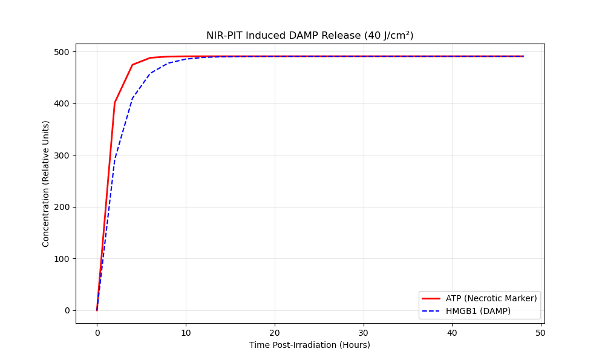

# PIT-Sim: NIR-PIT Kinetics Simulation Engine

[](https://github.com/haileymonaco/PIT-Sim-A-High-Performance-Simulation-Engine-for-NIR-PIT-Kinetics/actions)

A high-performance C++17 simulation engine that models the full biophysical pipeline of **Near-Infrared Photoimmunotherapy (NIR-PIT)** — from photon delivery through tissue to the downstream immune response — based on my published review:

> **Monaco, H. et al. (2022).** *Quickly evolving near-infrared photoimmunotherapy provides multifaceted approach to modern cancer treatment.* [`docs/`](docs/)

---

## What It Models

NIR-PIT works by activating an IR700 dye conjugated to a tumour-targeting antibody with 690 nm light, causing rapid, **immunogenic** cell death (ICD) rather than silent apoptosis. This engine simulates two physically coupled stages:

### Stage 1 — Monte Carlo Light Transport (`LightTransport`)

Photon packets are propagated through a voxelised 2-D tumour grid using a random-walk Monte Carlo scheme. Each packet deposits absorbed energy according to Beer–Lambert attenuation and scatters laterally at each step. The output is a 2-D fluence map from which the **mean delivered fluence** (J/cm²) is extracted.

- Parallelized with **OpenMP** — each thread owns an independent Mersenne Twister seeded for reproducibility
- Uses **Eigen** for the shared fluence accumulation matrix

### Stage 2 — ICD Biology (`ICDKinetics`)

The computed mean fluence drives a first-order DAMP release model. Three canonical ICD markers are tracked:

| Marker | Biology | Rate constant |
|--------|---------|--------------|
| **Calreticulin (CRT)** | Early "eat-me" signal on outer membrane | k = 1.20 hr⁻¹ |
| **ATP** | Rapid cytoplasmic release on membrane rupture | k = 0.85 hr⁻¹ |
| **HMGB1** | Slower nuclear translocation | k = 0.45 hr⁻¹ |

A Hill equation over the combined DAMP signal yields the **Dendritic Cell maturation probability** — a high probability (≥ 0.9) validates the antigen-spreading mechanism central to NIR-PIT's systemic efficacy.

### Pipeline coupling

```
LightTransport::simulate_photons()
        │
        └──▶ mean_fluence()
                    │
                    └──▶ ICDKinetics(tumor_volume, mean_fluence)
                                    │
                                    └──▶ update(t) for t in 0…48 h
                                                    │
                                                    └──▶ CSV + plot
```

---

## Simulation Results



**Figure:** DAMP release kinetics (top) and Dendritic Cell maturation probability (bottom) over 48 hours post-irradiation. The fluence used is the **computed** output of the Monte Carlo light transport module, not a hard-coded value.

---

## Build

### Prerequisites

| Platform | Requirements |
|----------|-------------|
| macOS (Apple Silicon) | `brew install llvm eigen` |
| Linux | `apt install g++ libeigen3-dev` (OpenMP bundled with GCC) |
| All | CMake ≥ 3.15 |

### Steps

```bash
git clone https://github.com/haileymonaco/PIT-Sim-A-High-Performance-Simulation-Engine-for-NIR-PIT-Kinetics.git
cd PIT-Sim-A-High-Performance-Simulation-Engine-for-NIR-PIT-Kinetics

cmake -B build -DCMAKE_BUILD_TYPE=Release
cmake --build build --parallel

./build/pit_sim
```

On macOS the build system automatically uses the Homebrew LLVM toolchain for OpenMP. You can override the prefix:

```bash
cmake -B build -DLLVM_PREFIX=/opt/homebrew/opt/llvm
```

### Visualise

```bash
pip install -r requirements.txt
python scripts/plot_results.py
```

---

## Project Structure

```
.
├── include/
│   ├── core/LightTransport.hpp    # Monte Carlo photon transport
│   └── biology/ICDKinetics.hpp    # DAMP release & DC maturation model
├── src/
│   ├── core/LightTransport.cpp
│   ├── biology/ICDKinetics.cpp
│   └── main.cpp                   # Coupled two-stage simulation pipeline
├── scripts/
│   └── plot_results.py            # Matplotlib visualisation
├── data/                          # Generated outputs (gitignored)
├── docs/                          # Published paper (Monaco et al. 2022)
├── CMakeLists.txt
└── requirements.txt
```

---

## Reference

Monaco, H., Yokomizo, S., Choi, H.S., & Kashiwagi, S. (2022). Quickly evolving near-infrared photoimmunotherapy provides multifaceted approach to modern cancer treatment. *[View Beijing]*. See [`docs/`](docs/) for the full PDF.
